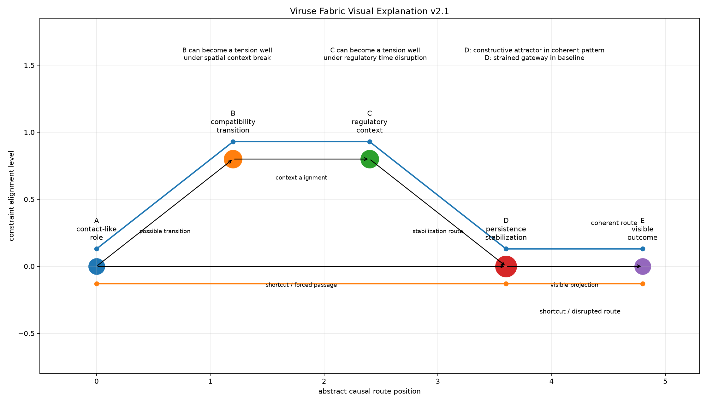

# Viruse Fabric Visual Explanation v2.1

## Purpose

This report connects the visual diagram to the computational story of Viruse Fabric. The figure is not decorative: it summarizes the same abstract route structure used in the apparent targeting and observer misreading experiments.

## Nodes

| Node | Role | Diagram label |
|---|---|---|
| A | start | A / contact-like / role |
| B | transition | B / compatibility / transition |
| C | context | C / regulatory / context |
| D | attractor | D / persistence / stabilization |
| E | outcome | E / visible / outcome |

## Scenarios

| Scenario | Path | Apparent targeting | Observer misreading | Constructive attractor | Tension well | Strained gateway |
|---|---|---:|---:|---|---|---|
| abstract_baseline | A → D → E | 8.70 | 40.44 | none | none | D |
| coherent_viral_pattern | A → B → C → D → E | 88.53 | 91.21 | D | none | none |
| spatial_context_break | A → D → E | 0.00 | 13.95 | none | B | none |
| regulatory_time_disruption | A → D → E | 0.00 | 13.95 | none | C | none |

## Interpretation

### abstract_baseline

The visible route is structured but costly. D acts as a strained gateway, not as evidence of intention.

### coherent_viral_pattern

The full route becomes target-like because a constructive attractor stabilizes the path. This is route coherence, not intention.

### spatial_context_break

B becomes a tension well. The path avoids the crisis node instead of selecting it as a target.

### regulatory_time_disruption

C becomes a tension well. Crisis concentration should not be misread as causal intention.

## Boundary

The diagram is conceptual and non-operational. It does not describe real pathogens, real hosts, laboratory protocols, biological mechanisms, or executable interventions.

## Theory Note

A visual layer is useful only if it remains connected to computed paths, scores, and classifications. Otherwise it becomes ornament. This version keeps the visual explanation tied to the earlier scenario results.
